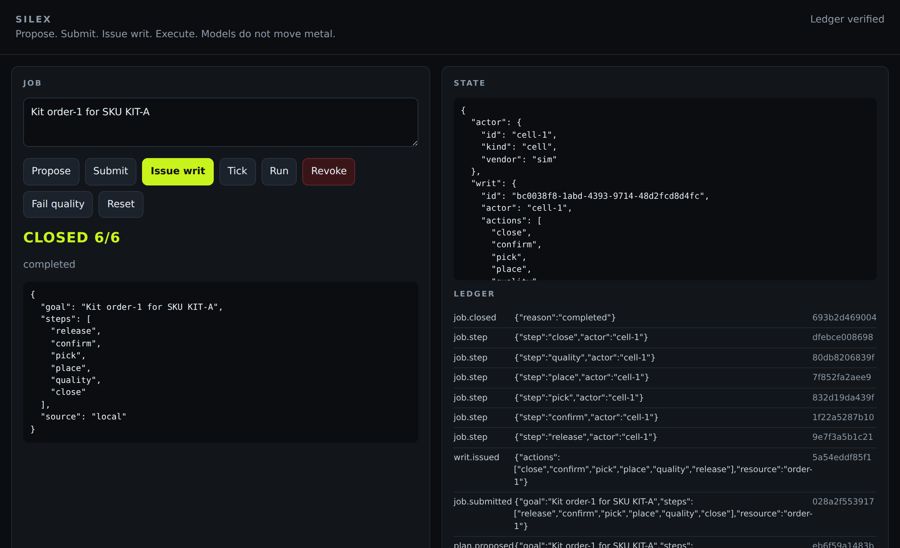

# Silex

[](https://github.com/maxmccutcheon59/silex-os/actions/workflows/test.yml)
[](LICENSE)

Authorization, execution, and audit kernel for mixed robot and agent fleets.

A job is an ordered list of steps. A writ is a capability for `(actor, action, resource)`. The runtime runs the next step only when a live writ allows it. Failed or denied steps restore prior world state. The ledger is hash-chained.

Silex is not a safety-certified motion controller. OEM safety systems remain in the loop. See [LEGAL.md](LEGAL.md).

Project brief: [maxmccutcheon59.github.io/silex-os](https://maxmccutcheon59.github.io/silex-os/) (source: [docs/index.html](docs/index.html))

## Install

```bash
python3 -m venv .venv
source .venv/bin/activate
pip install -e ".[dev]"
pytest -q
```

```bash
silex version
silex demo
silex replay
silex serve --host 127.0.0.1 --port 8080
```

`silex demo` runs a simulated kitting cell end to end and prints:

```text
status   closed
reason   completed
ledger   8 entries chain_ok=True
order    {'status': 'closed', 'sku': 'KIT-A'}
cell     {'ready': True, 'busy': False, 'vendor': 'sim'}
```

## Console

`silex serve` starts a local operator console. This is it after a job was proposed, submitted, given a writ, and run to completion; the ledger on the right is hash-chained and verified.



## Docs

| Asset | Use |
|---|---|
| [docs/index.html](docs/index.html) | One-page brief |
| [ARCHITECTURE.md](ARCHITECTURE.md) | Control flow |
| [PROTOCOL.md](PROTOCOL.md) | Adapter contract |
| `silex demo` / `silex serve` | Live walkthrough |

## License

MIT © Max McCutcheon. See [LICENSE](LICENSE).
